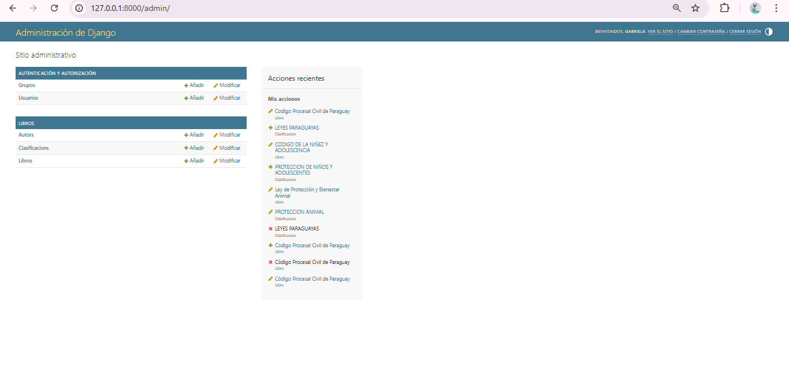
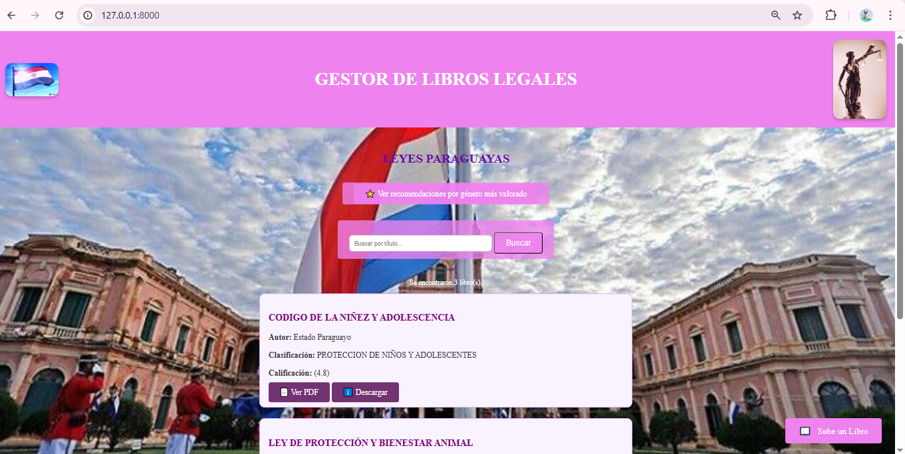
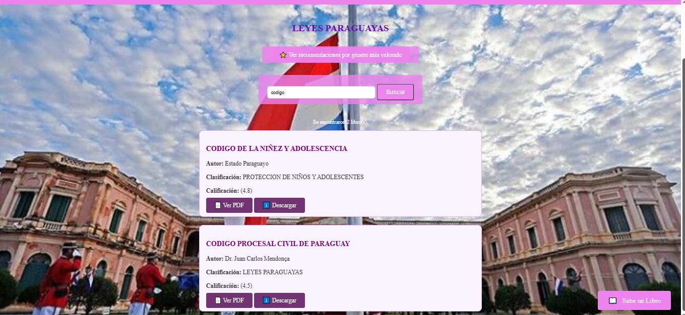
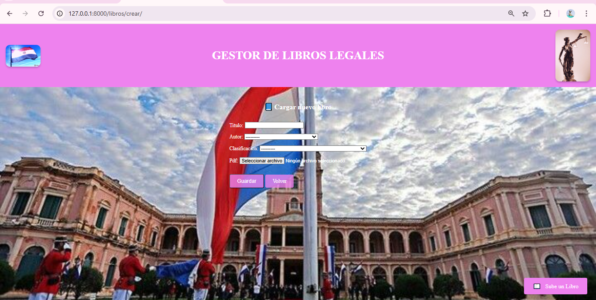
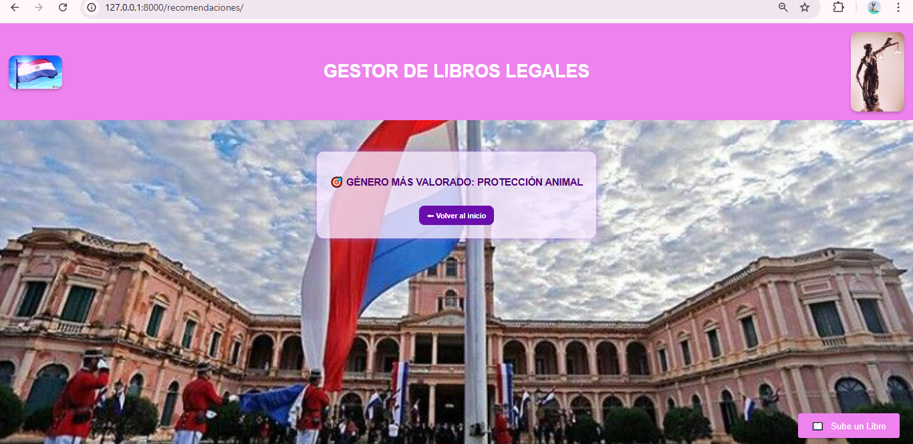
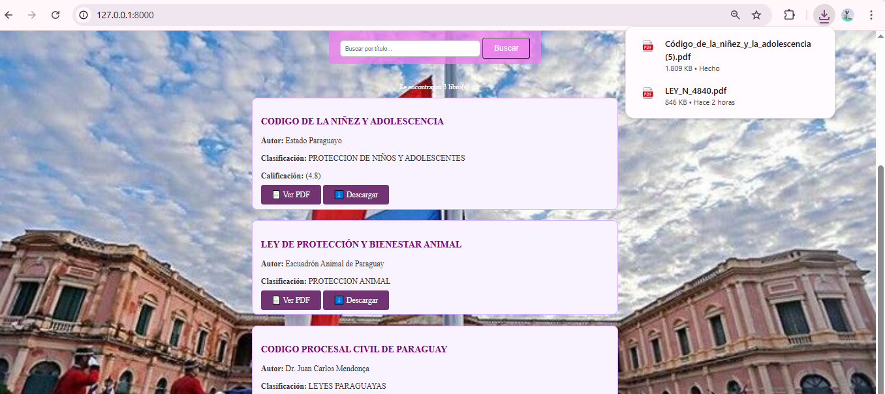
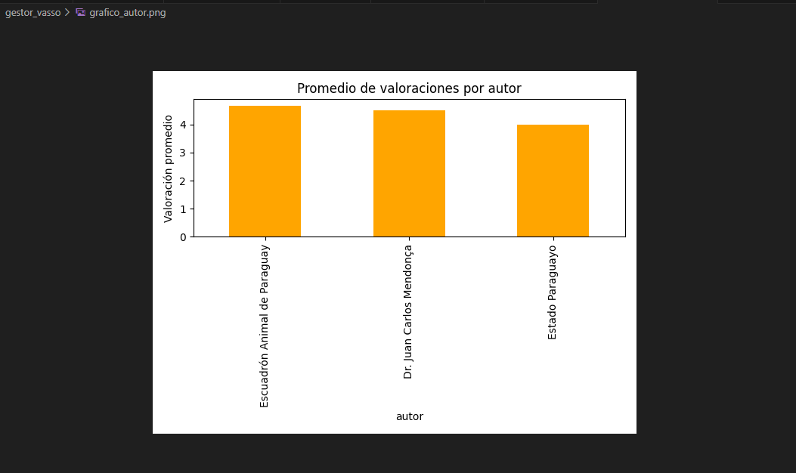
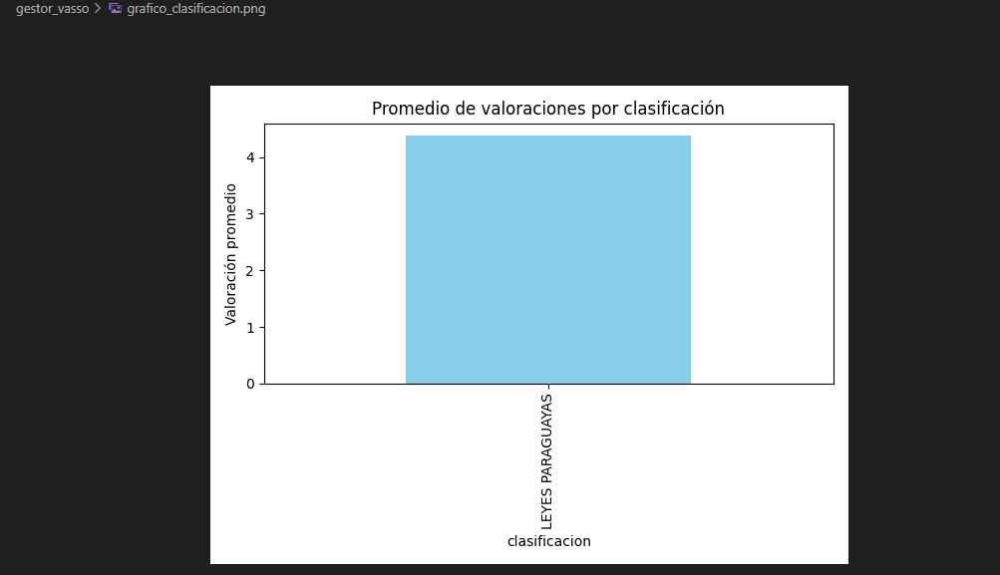
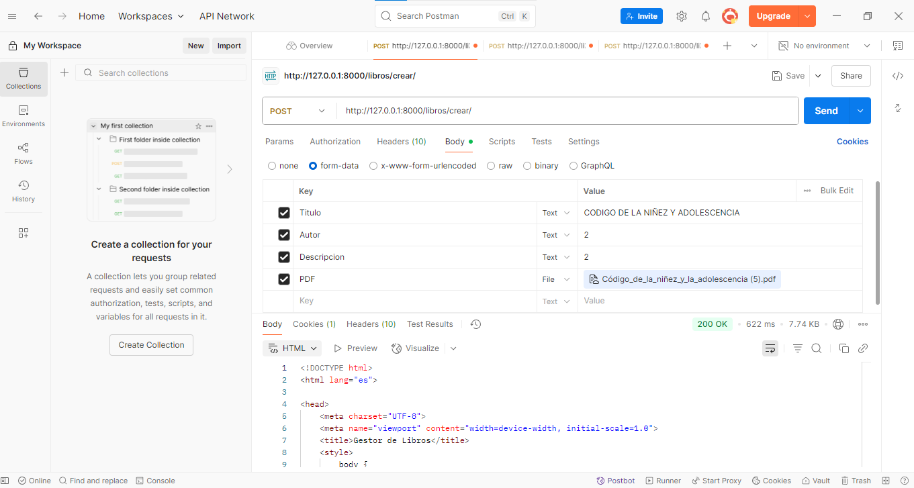

📚 Gestor de Libros Legales
LEYES PARAGUAYAS 🇵🇾

Este proyecto está diseñado para gestionar, visualizar y analizar libros legales en formato PDF relacionados con las leyes paraguayas. Desarrollado en Django como parte de la materia Programación V en la carrera de Ingeniería Informática.

Diseñado por: Gabriela Vasso – Ingeniería Informática – Programación 5 💻
________________________________________________________________________________________________________________________________________________________________________________      

✨ Funcionalidades principales
✅ Subida de libros: Permite cargar libros con título, autor, clasificación (género) y archivo PDF.

✅ Buscador de libros: Facilita la búsqueda de libros por título, autor o clasificación.

✅ Visualización y descarga de PDFs: Los usuarios pueden ver los libros en línea o descargarlos en formato PDF.

✅ Recomendaciones por género: El sistema sugiere libros basados en el género más valorado.

✅ Análisis de valoraciones con Pandas: Estadísticas y gráficos generados a partir de las valoraciones de los libros.

✅ Interfaz amigable: Uso de HTML y CSS para una experiencia de usuario moderna y profesional.
 
 📊Tabla de resumen de funcionalidades

 | Funcionalidad                | Descripción breve                                       |
|-----------------------------|---------------------------------------------------------|
| 📚 Subida de libros         | Permite cargar libros legales con PDF y metadatos       |
| 🔍 Búsqueda                 | Filtro por título, autor o género                       |
| 👁️ Visualizar y Descargar   | Opción de ver el PDF o descargarlo                      |
| ⭐ Valoraciones             | Análisis de puntajes con Pandas y gráficos              |
| 🤖 Recomendaciones          | Libros sugeridos según género mejor valorado            |

⚙️ Instalación paso a paso
1. Clonar el repositorio
Para obtener una copia local del proyecto, ejecuta:

bash
Copiar
Editar
git clone https://github.com/tu-usuario/Gestor_De_Libros.git
cd gestor-libros
2. Crear un entorno virtual
Es recomendable usar un entorno virtual para gestionar las dependencias:

bash
Copiar
Editar
python -m venv env
env\Scripts\activate  # En Windows
3. Instalar dependencias
Instala las dependencias del proyecto:

bash
Copiar
Editar
pip install -r requirements.txt
4. Realizar migraciones y crear superusuario
Para configurar la base de datos y crear el superusuario para acceder al panel de administración, ejecuta:

bash
Copiar
Editar
python manage.py migrate
python manage.py createsuperuser
5. Ejecutar el servidor
Para correr el servidor local, usa:

bash
Copiar
Editar
python manage.py runserver
Tu proyecto estará disponible en http://127.0.0.1:8000/.

📊 Tecnologías y versiones
Herramienta	Versión
Python	3.11.x
Django	5.2.4
Pandas	2.x
Matplotlib	3.x
Seaborn	0.13.x

📂 Estructura del proyecto
gestor_vasso/
├── env/                     ← Entorno virtual
├── gestor/                 ← Configuración del proyecto Django
│   ├── settings.py         ← Configuración principal
│   ├── urls.py             ← Enrutamiento de URLs
│   └── wsgi.py             ← Interfaz WSGI
├── libros/                 ← App principal: modelos, vistas, formularios
├── media/
│   └── libros_pdfs/        ← PDFs de los libros subidos
│   capturas_del_proyecto
├── static/                 ← Archivos estáticos (CSS, imágenes)
├── templates/
│   └── libros/             ← Plantillas HTML del proyecto
├── valoraciones.csv        ← Dataset con valoraciones
├── grafico_autor.png       ← Gráfico de distribución de valoraciones por autor
├── grafico_clasificacion.png ← Gráfico por clasificación
├── requirements.txt        ← Paquetes necesarios
├── manage.py               ← Ejecuta comandos de Django
├── db.sqlite3              ← Base de datos local
└── README.md               ← Documentación del proyecto

📅 Funcionamiento del programa
Formulario para crear libros: Desde el panel de administración (/admin/) o mediante una vista personalizada, los usuarios pueden registrar libros con título, autor, clasificación y archivo PDF.

Listar libros: Los libros registrados se muestran en una página con opciones para visualizarlos o descargarlos.

Filtros de búsqueda: Los usuarios pueden buscar libros por título, autor o clasificación.

Valoraciones y recomendaciones: Los usuarios pueden valorar los libros y recibir recomendaciones basadas en el género más valorado.

📸 Capturas del sistema
📌 Crear libro
Formulario desde el navegador:

Carga desde Postman:
Postman fue utilizado para probar la carga de libros mediante la API de forma controlada, verificando la correcta recepción de archivos PDF y datos asociados.

📌 Listado de libros
Vista general con filtros y botones:

📌 Sugerencias por género
Basado en el promedio más alto:

📊 Análisis con Pandas
Para realizar el análisis de las valoraciones de los libros, se usó el archivo CSV valoraciones.csv, el cual contiene las siguientes columnas:

libro_id

genero

valoracion

Este archivo permite procesar y analizar los datos de valoraciones para obtener estadísticas y gráficos.

📄 Script para leer valoraciones:
python
Copiar
Editar
import pandas as pd
import matplotlib.pyplot as plt

# Leer archivo CSV de valoraciones
df = pd.read_csv('valoraciones.csv')
print(df.head())

# Promedio por género
promedios = df.groupby("genero")["valoracion"].mean()
print(promedios)
📈 Gráficos generados
1⃣ Género más valorado (barra)
Este gráfico muestra el promedio de valoraciones por género. Es útil para ver qué géneros son más populares entre los usuarios.

python
Copiar
Editar
promedios.plot(kind="bar", title="Promedio de valoraciones por género")
plt.xlabel("Género")
plt.ylabel("Valoración promedio")
plt.show()

2⃣ Distribución de valoraciones (histograma)
Este gráfico muestra la distribución de las valoraciones dadas por los usuarios.

python
Copiar
Editar
df["valoracion"].plot(kind="hist", bins=5, title="Distribución de valoraciones")
plt.xlabel("Valoración")
plt.show()

🤖 Recomendaciones por género
El sistema obtiene el género con mejor promedio de valoración y muestra libros relacionados con ese género.

python
Copiar
Editar
genero_top = df.groupby("genero")["valoracion"].mean().idxmax()
libros_recomendados = Libro.objects.filter(clasificacion__nombre=genero_top)
🌐 Herramientas usadas para desarrollo
Postman: Para probar la creación de libros mediante la API.

Google Colab: Para graficar y analizar los datos desde el archivo CSV.

GitHub: Para control de versiones y gestión del código.

⚖️ Licencias
Herramienta	Licencia
Python	PSF License
Django	BSD License
Pandas	BSD License
Matplotlib	PSF Compatible
Seaborn	BSD License
PostgreSQL	PostgreSQL License

### 📸 Capturas del resultado del proyecto

🧠 Lecciones aprendidas

- Cómo estructurar un proyecto Django con buenas prácticas.
- Uso de Pandas para análisis de datos reales.
- Aplicación de diseño personalizado con CSS y recursos visuales.

📚 Créditos
Este proyecto fue realizado con dedicación y 💜 por:

🌟Gabriela Vasso🌟
Estudiante de Ingeniería Informática
Materia: Programación 5
Año: 2025

                           
🎓 **Conclusión**

Este proyecto ha sido una excelente oportunidad para aplicar mis conocimientos de Django, Pandas y visualización de datos. Además, aprendí a crear una interfaz limpia y funcional, incorporando elementos visuales modernos como fondos patrióticos, estrellas de calificación y una estética lavanda que refleja el compromiso con el detalle.

💜 Estoy orgullosa del resultado y espero que sea útil para quienes necesiten acceder a leyes paraguayas de forma clara y organizada.

